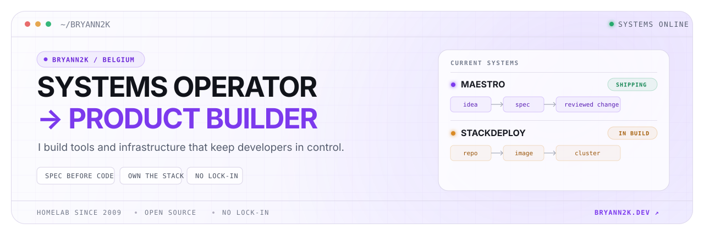

<picture>
  <source media="(prefers-color-scheme: dark)" srcset="./assets/profile-hero-dark.svg">
  <source media="(prefers-color-scheme: light)" srcset="./assets/profile-hero-light.svg">
  
</picture>

  <a href="https://bryann2k.dev"><strong>bryann2k.dev</strong></a>
  &nbsp;·&nbsp;
  <a href="https://github.com/BRYANN2K/maestro">Maestro</a>
  &nbsp;·&nbsp;
  <a href="https://bryann2k.dev/projects/stackdeploy">StackDeploy</a>
  &nbsp;·&nbsp;
  <a href="https://x.com/bryann2k_dev">@bryann2k_dev</a>

I spent five years keeping systems and networks alive. Now I turn that experience into terminal-native developer tools, self-hosted infrastructure, and products designed with an exit door.

## What I'm shipping

<table>
  <tr>
    <td width="50%" valign="top">
      <h3>Maestro <code>OPEN SOURCE</code></h3>
      
A terminal-native, spec-driven environment for AI-assisted development. It turns an idea into a reviewed, documented change while keeping every phase behind an explicit human decision.

      <a href="https://github.com/BRYANN2K/maestro"><strong>Explore Maestro →</strong></a>
    </td>
    <td width="50%" valign="top">
      <h3>StackDeploy <code>IN BUILD</code></h3>
      
Repo to workload on your own Kubernetes cluster—with GitOps deploys, readable logs, and rollback, without handing your infrastructure to a proprietary platform.

      <a href="https://bryann2k.dev/projects/stackdeploy"><strong>Follow StackDeploy →</strong></a>
    </td>
  </tr>
</table>

Also shipped: <a href="https://github.com/BRYANN2K/layout-autoswitch"><strong>layout-autoswitch</strong></a>, a user-level Shell service that switches GNOME layouts when Bluetooth keyboards connect or disconnect.

## The route here

| | Chapter | What changed |
|---:|---|---|
| `2009 → today` | **Homelab** | From Debian game servers to a four-node, GitOps-managed cluster. |
| `5 years` | **Systems & networking** | Kept a company's infrastructure running and learned to enjoy the incidents nobody could explain. |
| `1 year` | **Cloud engineering** | Went deeper on Linux, Terraform, containers, and Kubernetes. |
| `now` | **Solo founder** | Turning infrastructure scars into tools people can inspect, own, and replace. |

## How I build

- **Spec before code.** Make the decisions reviewable before implementation starts.
- **No lock-in by design.** Standard stacks, portable data, and infrastructure you can walk away from.
- **Real systems, not deck slides.** Ship it, observe it, fix it, write down what mattered.

## Toolbelt

`Go` · `Linux` · `Kubernetes` · `Terraform` · `Docker` · `Argo CD` · `GitHub Actions` · `TypeScript` · `Astro` · `PostgreSQL`

  
<strong>Certifications, kept out of the trophy cabinet</strong>

   
  <ul>
    <li>Certified Kubernetes Administrator — CNCF / Linux Foundation, 2025</li>
    <li>HashiCorp Terraform Associate — HashiCorp, 2025</li>
    <li>Linux Foundation Certified System Administrator — Linux Foundation, 2023</li>
  </ul>

## Compare notes

Building developer tools, self-hosted systems, or infrastructure people can actually own? Tell me what you're working on.

**[Read the build log](https://bryann2k.dev/log)** · **[Say hello](mailto:hello@bryann2k.dev)**
