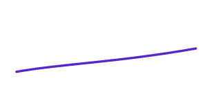

<picture>
  <source media="(prefers-color-scheme: dark)" srcset="assets/name-dark.svg">
  
</picture>

Product engineer. I build products from idea to production, interface to infrastructure. 
Brussels · Cebu City

&nbsp;**Open to work.** Freelance or full-time, remote on EU hours. [Contact me →](https://bryann2k.dev/#contact)

[bryann2k.dev](https://bryann2k.dev) &nbsp;·&nbsp; [Build log](https://bryann2k.dev/log) &nbsp;·&nbsp; [X](https://x.com/bryann2k_dev) &nbsp;·&nbsp; [hello@bryann2k.dev](mailto:hello@bryann2k.dev)

#### Selected work

[**Stipulate**](https://github.com/BRYANN2K/stipulate-skills) 
Spec-driven development for AI coding agents, from exploration to verified delivery.

[**Maestro**](https://github.com/BRYANN2K/maestro) 
An AI spec-driven harness for terminal development.

[**StackDeploy**](https://bryann2k.dev/projects/stackdeploy) paused 
Your own Kubernetes cluster, with the ease of a PaaS.

#### Before that

Five years running systems and networks, then a year as a freelance cloud engineer: 11 clients, mostly infrastructure audits, and 3 builds.

Specs before code. Standard tools over proprietary platforms. Working systems over slide decks.

#### Stack

&nbsp;&nbsp;
&nbsp;&nbsp;
&nbsp;&nbsp;
&nbsp;&nbsp;
&nbsp;&nbsp;
&nbsp;&nbsp;
&nbsp;&nbsp;
&nbsp;&nbsp;
&nbsp;&nbsp;
&nbsp;&nbsp;
&nbsp;&nbsp;
&nbsp;&nbsp;
&nbsp;&nbsp;

  
&nbsp;&nbsp;
&nbsp;&nbsp;
&nbsp;&nbsp;
&nbsp;&nbsp;
&nbsp;&nbsp;
&nbsp;&nbsp;
&nbsp;&nbsp;
&nbsp;&nbsp;
&nbsp;&nbsp;
&nbsp;&nbsp;
&nbsp;&nbsp;
&nbsp;&nbsp;
&nbsp;&nbsp;

Also AWS and Kyverno. Certified CKA (2025), HashiCorp Terraform Associate (2025), LFCS (2023).

 

<picture>
  <source media="(prefers-color-scheme: dark)" srcset="assets/signature-dark.svg">
  
</picture>

 

<picture>
  <source media="(prefers-color-scheme: dark)" srcset="https://raw.githubusercontent.com/BRYANN2K/BRYANN2K/output/commit-invaders-dark.svg">
  
</picture>

